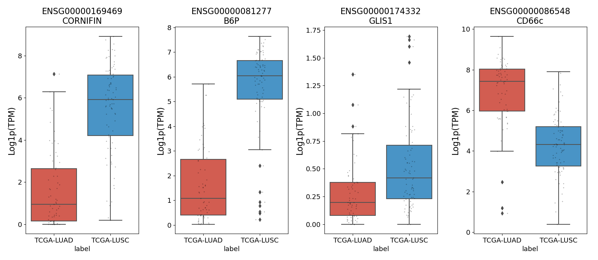
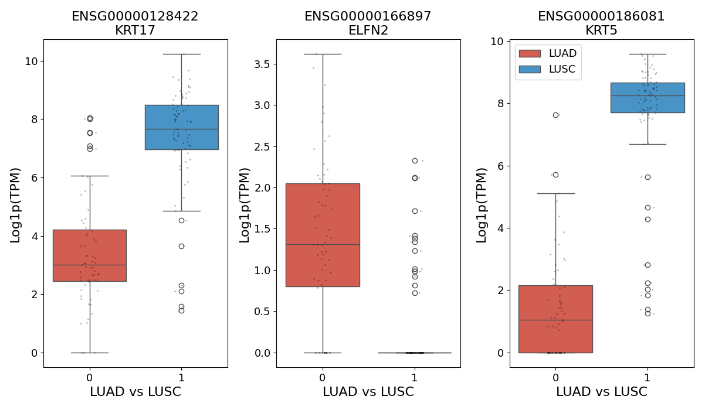
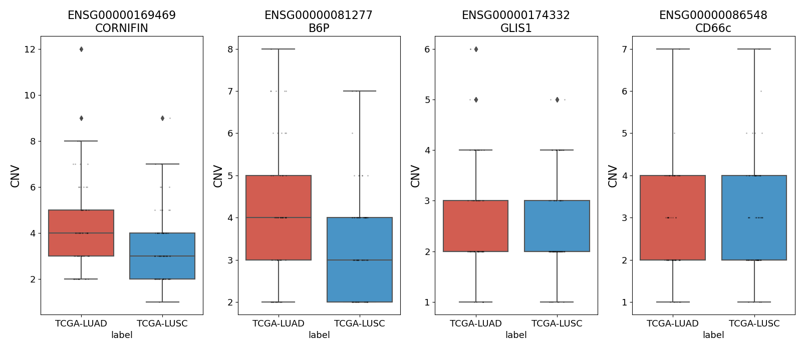

→ [Paper]()
- [click here](https://drive.google.com/file/d/1fAwKPWR0kBsjv7-1tGSWkcCTuvHEl0yN/view?usp=drive_link) to download our original dataset retrieved from GCD Data Portal
- [click here](https://drive.google.com/file/d/1vup2z04FoucfkQkzjX4i5d7ChMva69Ag/view?usp=drive_link) to download our processed graphs Dataset

## Architecture

<p align="center">
  
  
</p>
<p align="center">
  <strong>Figure 1.</strong> High-level overview of the project architecture for the lung dataset.
</p>

<p align="center">
  
  
</p>
<p align="center">
  <strong>Figure 2.</strong> High-level overview of the project architecture for the kidney dataset.
</p>

## Explainability
[model_analysis_functions.py](model_analysis_functions.py) provides functions for the interpretation of the learned models decisional processes and what features they focus on:

- Graph branch attention scores (`get_gene_attention_weights` function) retrieves the attention scores given to each gene by the GAT-GNN layers, with higher scores to the genes that the model learned to monitor more closely.

```
2026-04-09 11:56:00,592 - INFO - Genes with attention importance = 1.000:
2026-04-09 11:56:00,737 - INFO - ENSG00000128422: 1.0000   ['PC2', 'PC2', 'PC2', 'PC2', 'Pc2', '39.1', 'CK-17', 'K17', 'KRT17', 'PC2', 'PCHC1']
2026-04-09 11:56:00,741 - INFO - ENSG00000119147: 1.0000   ['C2orf40', 'ECRG4']
2026-04-09 11:56:00,742 - INFO - ENSG00000119632: 1.0000   ['FAM14A', 'IFI27L2', 'ISG12B', 'TLH29']
2026-04-09 11:56:00,857 - INFO - ENSG00000124107: 1.0000   ['ALP', 'ALK1', 'BLPI', 'HUSI', 'HUSI-I', 'SLPI', 'WAP4', 'WFDC4', 'ALP']
2026-04-09 11:56:02,203 - INFO - ENSG00000162733: 1.0000   ['DDR2', 'MIG20a', 'NTRKR3', 'TYRO10', 'WRCN']
...
```

- Saliency (`get_gene_saliency` function) computes which genes influence the model's decision by having more relevance in the gradient computation.

```
2026-04-09 17:10:59,946 - INFO - Top 100 Genes saliency:
2026-04-09 17:10:59,950 - INFO - ENSG00000185201: 1.0000   ['1-8D', 'DSPA2c', 'IFITM2']
2026-04-09 17:10:59,951 - INFO - ENSG00000205420: 0.6538   ['CK-6C', 'CK-6E', 'K6C', 'KRT6C', 'PC3', 'CK-6C', 'CK-6E', 'CK6A', 'CK6C', 'CK6D', 'K6A', 'K6C', 'K6D', 'KRT6A', 'KRT6C', 'KRT6D', 'PC3']
2026-04-09 17:10:59,952 - INFO - ENSG00000011600: 0.5574   ['DAP12', 'KARAP', 'PLOSL', 'PLOSL1', 'TYROBP']
2026-04-09 17:10:59,953 - INFO - ENSG00000173599: 0.4210   ['PC', 'PC', 'PC', 'PC', 'PCB']
2026-04-09 17:10:59,954 - INFO - ENSG00000019582: 0.3975   ['CD74', 'CLIP', 'DHLAG', 'HLADG', 'Ia-GAMMA', 'CLIP', 'II', 'II', 'P33', 'p33']
2026-04-09 17:10:59,955 - INFO - ENSG00000186395: 0.3811   ['EHK', 'BCIE', 'BIE', 'CK10', 'K10', 'KPP', 'KRT10', 'EHK2']
2026-04-09 17:10:59,957 - INFO - ENSG00000171401: 0.3503   ['CK13', 'K13', 'KRT13', 'WSN2', 'K13']
2026-04-09 17:10:59,958 - INFO - ENSG00000186832: 0.3351   ['CK16', 'FNEPPK', 'K16', 'K1CP', 'KRT16', 'KRT16A']
2026-04-09 17:10:59,959 - INFO - ENSG00000186081: 0.3284   ['CK5', 'DDD', 'DDD1', 'EBS2', 'K5', 'KRT5', 'KRT5A']
...
```

→ Boxplots are employed in the visualization of the selected genes features values through the test patients dataset:

<p align="center">

Expression (RNA) values | Other biomarkers
:-------------------------:|:-------------------------:
  |  

CNV values | Methylation values
:-------------------------:|:-------------------------:
  |  

</p>

- Clinical importance (`explain_clinical_importance` function) explains which clinical features, if any, most influence the prediction accuracy.

```
2026-04-01 15:12:34,071 - INFO - Clinical Features importance:
2026-04-01 15:12:34,071 - INFO - age_at_index: 0.0070
2026-04-01 15:12:34,071 - INFO - country_of_residence_at_enrollment: 0.0070
2026-04-01 15:12:34,071 - INFO - gender: 0.0070
2026-04-01 15:12:34,071 - INFO - ajcc_pathologic_n: 0.0070
2026-04-01 15:12:34,072 - INFO - tissue_or_organ_of_origin: 0.0070
2026-04-01 15:12:34,072 - INFO - ethnicity: 0.0000
2026-04-01 15:12:34,072 - INFO - race: 0.0000
...
```

## How to execute

### Running the Script
To run the script [main.py](main.py) it's possible to use or the command-line arguments or a configuration file.

#### With a Configuration File
The [config.py](config.py) file defines the main global settings used throughout the project, including dataset selection, model choice, training mode and directory paths.
The settings can be modified by editing the file:
- `tumor`, specifies the type of tumor to analyze. Only one value should be active at a time (uncomment the desired option).

- `model`, defines the model architecture used for training. Only one value should be active at a time (uncomment the desired option).

- `mode`, sets the execution strategy of the pipeline:
  - `kfold`, k-fold cross-validation
  - `gridsearch`, graph classification using grid search
  - `montecarlo`, Monte Carlo evaluation

The path configuration are defined in the `PATHS` dictionary: 
- `DATASET`, path to the folder containing the original dataset.

- `FILES`, path where processed files are saved and loaded during execution.

> ⚠️ Changes here affect the entire pipeline execution.

#### With Command-Line Arguments
Use a terminal and execute the following command:
```bash
python .\main.py --dataset <dataset_name> --model-name <model_name> --mode <mode> [--force]
```
Where the arguments are:
- `--dataset`, specifies the dataset to be used for the pipeline (example: lung or kidney). The available options are automatically detected from the **config.DATASET/** directory at runtime.

- `--model-name`, defines which model will be used for training and evaluation. The list of available models is dynamically loaded from the **models/** directory (each **.py** file represents a model).

- `--mode`, sets the execution strategy of the pipeline:
  - `kfold`: performs k-fold cross-validation
  - `gridsearch`: runs graph classification using grid search
  - `montecarlo`: performs Monte Carlo-based evaluation

- `--force`, it's a boolean flag. If enabled, forces the regeneration of the file **STRING_downloaded_files/9606.protein.aliases.gene.tsv** even if it already exists

> 🆘 With the help option you can display all available arguments and their descriptions using:
>
> ```bash
> python .\main.py --help
> ```

> ⚠️ If you don't use the command-line arguments, the default values defined in the [config.py](config.py) file will be used.

### Get the data

1) The dataset must be downloaded from the desired source, like GDC Data Portal (https://portal.gdc.cancer.gov/), and saved in a folder named as the tumor selected. This folder must be put inside a folder called **original_dataset/**, see the variable **DATASET** inside the [config.py](config.py). For example, our data for the Lung and the Kidney tumor (click [here](https://drive.google.com/file/d/1fAwKPWR0kBsjv7-1tGSWkcCTuvHEl0yN/view?usp=drive_link) to download) was originally in this form:

    ```
    original_dataset/
        lung/
            clinical/
                clinical.tsv
                exposure.tsv
                LUAD_LUSC_metadata.json : file mapping, necessary to map exposure and clinical to CNV,RNA and methylation data (different file_id)
            CNV/
                722 patients folders
            methylation/
                758 patients folders
            RNA/
                757 patients folders
        kidney/
            clinical/
                clinical.tsv
                exposure.tsv
                KIRC_KIRP_KICH_metadata.json : file mapping, necessary to map exposure and clinical to CNV,RNA and methylation data (different file_id)
            CNV/
                2781 patients folders
            methylation/
                665 patients folders
            RNA/
                1028 patients folders
    ```

2) By executing the script [main.py](main.py) it's possible to:

   1) Extract the correctly formatted files in a new **files/** folder, see the variable **FILES** inside the [config.py](config.py), using the `process_dataset` function, located in [files_extraction_and_mapping.py](files_extraction_and_mapping.py). This will be our new reference folder:
      
        ```
        files/
            lung/
                clinical/
                    file_case_mapping.tsv
                    omics_files.tsv
                CNV/
                    extracted patients .tsv files
                methylation/
                    extracted patients .txt files
                RNA/
                    extracted patients .tsv files
            kidney/
                clinical/
                    file_case_mapping.tsv
                    omics_files.tsv
                CNV/
                    extracted patients .tsv files
                methylation/
                    extracted patients .txt files
                RNA/
                    extracted patients .tsv files
        ```
   2) We downloaded from the [STRING](https://string-db.org/cgi/download?sessionId=bUEKUGQV7g5H&species_text=Homo+sapiens&settings_expanded=0&min_download_score=0&filter_redundant_pairs=0&delimiter_type=txt) database the following files, used later on to retrieve genes properties and build the graphs based on their codified proteins (click to start the download):
         - [9606.protein.aliases.v12.0.txt](https://stringdb-downloads.org/download/protein.links.v12.0/9606.protein.links.v12.0.txt.gz) 
         - [9606.protein.links.v12.0.txt](https://stringdb-downloads.org/download/protein.aliases.v12.0/9606.protein.aliases.v12.0.txt.gz)
   
      → Put them in a new **STRING_downloaded_files/** folder and using the functions located in [STRING_files_to_tsv.py](STRING_files_to_tsv.py):
         - `create_gene_aliases_proteins_ids_mapping_file`, creates **STRING_downloaded_files/9606.protein.aliases.gene.tsv**
         - `create_genes_id_mapping_file`, creates **STRING_downloaded_files/gene_ids_mapped.tsv**.
      > ⚠️ The execution of the first function can take a few hours. If the file already exists, it will be skipped.
   
   3) We need also a methylation manifest for the preprocessing of methylation data; we downloaded from the relative [Illumina support page](https://support.illumina.com/downloads/infinium_humanmethylation450_product_files.html) the one relative to the Illumina “450 K array” technology (click [here](https://webdata.illumina.com/downloads/productfiles/humanmethylation450/humanmethylation450_15017482_v1-2.csv) to start the download). 
    
      → Put it in **methylation_manifests/originals_downloaded/** and using the function `create_meth_manifest`, located in [methylation_manifest_to_tsv.py](methylation_manifest_to_tsv.py), to extract only the necessary information correctly formatted.


### Preprocessing and running the model

Continue the execution of [main.py] (main.py) to preprocess the data:

1) Use the functions `build_features_considered` and `build_features_encoded`, located in [preprocessing_clinical_features_to_file.py](preprocessing_clinical_features_to_file.py), to obtain the following files:
   ```
   files/
      lung/
          clinical/
              features_considered.tsv  ←
              features_encoded.tsv  ←
              file_case_mapping.tsv
              omics_files.tsv
      kidney/
          clinical/
              features_considered.tsv  ←
              features_encoded.tsv  ←
              file_case_mapping.tsv
              omics_files.tsv
   ```

2) Use the function `build_patient_split_cleaned`, located in [train_test_patients_split.py](train_test_patients_split.py), to assign to each patient (case_id) a label [*train, val, test*]:

   ```
   files/
      lung/
         clinical/
            features_considered.tsv
            features_encoded.tsv
            file_case_mapping.tsv
            omics_files.tsv
            patient_split_cleaned.csv  ←
      kidney/
         clinical/
            features_considered.tsv
            features_encoded.tsv
            file_case_mapping.tsv
            omics_file.tsv
            patient_split_cleaned.csv  ←
   ```
   
3) Independently of the mode select, one of the following files [k_folds_graph_classification.py](k_folds_graph_classification.py), [graph_classification_grid_search.py](graph_classification_grid_search.py) or [montecarlo_graph_classification.py](montecarlo_graph_classification.py) will be run to create the patients graphs Dataset (if the folders do not already exist). The result will be this structure:

   ```
   data_graphs_processed/
       lung/
          data_graphs_processed_test/
          data_graphs_processed_train/
          data_graphs_processed_validation/
       kidney/
          data_graphs_processed_test/
          data_graphs_processed_train/
          data_graphs_processed_validation/
   ```
   
   > ⚠️ The first execution can take a few hours. It will not start again unless the folders get deleted or renamed.
   ###### Click [here](https://drive.google.com/file/d/1vup2z04FoucfkQkzjX4i5d7ChMva69Ag/view?usp=drive_link) to download the this structure of our processed graphs Dataset for both the tumors.

   Then automatically the model will be trained and evaluated.   
   > ⚠️ Training the model can take many hours depending on the hardware configuration, especially if you are using a device without a GPU.

## Results
All our results are available in our [paper]().

## Try with different tumor classes
You can try with different tumor classes by changing the value of the variable **tumor** in the [config.py](config.py) file.

The classification task can be done for multi-class tumor subtypes.
